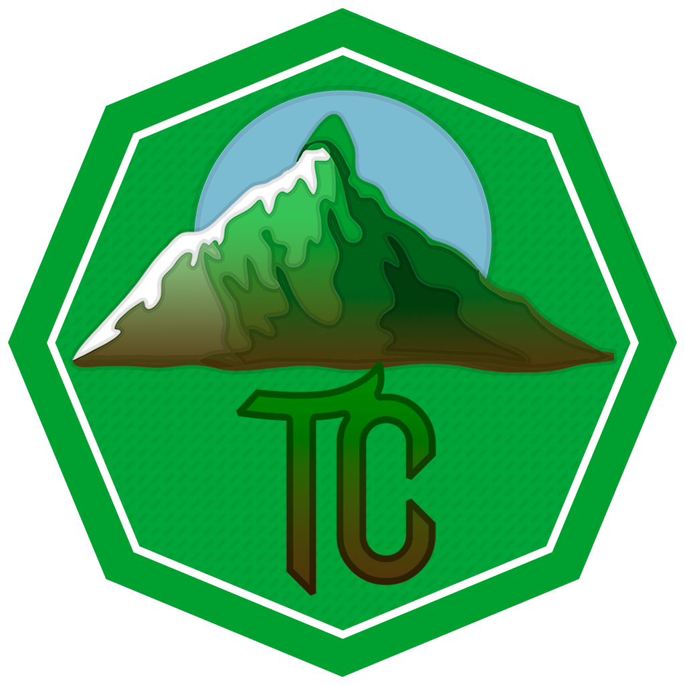

<h1 align="center">Tundracraft Launcher</h1>

<em><h5 align="center">(fork of Farfania/Helios)</h5></em>

[
](https://www.travis-ci.com/github/Tundracraft-Server/TundracraftLauncher) 

This is a launcher made for the Tundracraft server, automatically installing and updating all the mods required. More indev info on the <a href="https://github.com/dscalzi/HeliosLauncher">original repo</a>.

